# Enrolla — Band 1 ERD (Finalised)

**Multi-tenant education SaaS platform**
Finalised: 2026-04-25 — all open flags from the draft ERD resolved and applied.

Migration files: [`supabase/migrations/001–014`](../supabase/migrations/)

---

## Contents

1. [Entity-Relationship Diagram](#1-entity-relationship-diagram)
2. [Table Catalog](#2-table-catalog)
3. [RLS Policy Notes](#3-rls-policy-notes)
4. [Schema Status](#4-schema-status)

---

## 1. Entity-Relationship Diagram

Changes applied from resolved flags:
- `tenants` gains `invoice_prefix text`
- `tenant_sequences` gains `last_invoice_seq integer`
- `staff_branches` has no `department_id` — branch assignment only
- `subjects` gains `branch_id` (denormalised from `departments`)
- New table `package_subjects` (packages ↔ subjects junction)
- `credits` has `CHECK (student_id IS NOT NULL OR guardian_id IS NOT NULL)`
- Partial unique index on `academic_years (branch_id) WHERE is_current = true`

Patches applied 2026-04-25:
- `subjects` — invariant comment: `branch_id` must match `department_id → departments.branch_id`; enforced in PATCH handler
- `packages` — gains `session_type`, `sessions_per_subject`, `validity_type`, `validity_end_date`, `validity_duration_days`
- `withdrawals` — gains `refund_status text NOT NULL DEFAULT 'none'`
- `student_guardians` — partial unique index enforcing one primary guardian per student
- `staff.email` — documented as source of truth; app must sync `auth.users.email` on change
- `invoices` — `UNIQUE (tenant_id, invoice_number)` constraint added

```mermaid
erDiagram

  tenants {
    uuid id PK
    text name
    text slug
    text invoice_prefix "nullable"
    text status
    timestamptz created_at
    timestamptz updated_at
  }

  tenant_sequences {
    uuid id PK
    uuid tenant_id FK
    int last_student_seq
    int last_invoice_seq
  }

  branches {
    uuid id PK
    uuid tenant_id FK
    text name
    text address
    text phone
    text email
    numeric vat_rate
    bool is_active
    timestamptz created_at
    timestamptz updated_at
  }

  departments {
    uuid id PK
    uuid tenant_id FK
    uuid branch_id FK
    text name
    int default_makeup_allowance
    timestamptz created_at
    timestamptz updated_at
  }

  year_groups {
    uuid id PK
    uuid tenant_id FK
    uuid branch_id FK
    text name
    int sort_order
    timestamptz created_at
    timestamptz updated_at
  }

  subjects {
    uuid id PK
    uuid tenant_id FK
    uuid branch_id FK
    uuid department_id FK
    uuid year_group_id FK
    text name
    numeric price
    int session_duration_minutes
    bool is_active
    timestamptz created_at
    timestamptz updated_at
  }

  rooms {
    uuid id PK
    uuid tenant_id FK
    uuid branch_id FK
    text name
    int capacity
    bool is_active
    timestamptz created_at
    timestamptz updated_at
  }

  academic_years {
    uuid id PK
    uuid tenant_id FK
    uuid branch_id FK
    text name
    date start_date
    date end_date
    bool is_current
    timestamptz created_at
    timestamptz updated_at
  }

  terms {
    uuid id PK
    uuid tenant_id FK
    uuid academic_year_id FK
    text name
    date start_date
    date end_date
    timestamptz created_at
  }

  calendar_periods {
    uuid id PK
    uuid tenant_id FK
    uuid branch_id FK
    text name
    date start_date
    date end_date
    text period_type
    timestamptz created_at
  }

  public_holidays {
    uuid id PK
    uuid tenant_id FK
    uuid branch_id FK
    text name
    date holiday_date
    timestamptz created_at
  }

  schools {
    uuid id PK
    uuid tenant_id "nullable"
    text name
    text address
    text phone
    text status
    timestamptz created_at
    timestamptz updated_at
  }

  staff {
    uuid id PK
    uuid tenant_id FK
    uuid user_id "auth.users ref nullable"
    text first_name
    text last_name
    text email
    text phone
    text role
    text status
    timestamptz created_at
    timestamptz updated_at
  }

  staff_branches {
    uuid id PK
    uuid tenant_id FK
    uuid staff_id FK
    uuid branch_id FK
    bool is_primary
    timestamptz created_at
    timestamptz updated_at
  }

  students {
    uuid id PK
    uuid tenant_id FK
    int student_number
    text first_name
    text last_name
    date date_of_birth
    text gender
    text email
    text phone
    text address
    uuid school_id "nullable FK"
    text status
    text emergency_contact_name "nullable"
    text emergency_contact_phone "nullable"
    text emergency_contact_relationship "nullable"
    text notes
    timestamptz created_at
    timestamptz updated_at
  }

  guardians {
    uuid id PK
    uuid tenant_id FK
    text first_name
    text last_name
    text email
    text phone
    text address
    text occupation
    text notes
    timestamptz created_at
    timestamptz updated_at
  }

  student_guardians {
    uuid id PK
    uuid tenant_id FK
    uuid student_id FK
    uuid guardian_id FK
    text relationship
    bool is_primary
    bool is_emergency_contact
    bool can_pickup
    timestamptz created_at
    timestamptz updated_at
  }

  guardian_co_parent_links {
    uuid id PK
    uuid tenant_id FK
    uuid guardian_a_id FK
    uuid guardian_b_id FK
    text status
    timestamptz confirmed_at "nullable"
    timestamptz created_at
  }

  sibling_links {
    uuid id PK
    uuid tenant_id FK
    uuid student_a_id FK
    uuid student_b_id FK
    timestamptz created_at
  }

  packages {
    uuid id PK
    uuid tenant_id FK
    uuid branch_id FK
    text name
    text description
    numeric price
    bool is_active
    text session_type
    int sessions_per_subject "nullable"
    text validity_type "nullable"
    date validity_end_date "nullable"
    int validity_duration_days "nullable"
    timestamptz created_at
    timestamptz updated_at
  }

  package_subjects {
    uuid id PK
    uuid tenant_id FK
    uuid package_id FK
    uuid subject_id FK
    timestamptz created_at
  }

  enrolments {
    uuid id PK
    uuid tenant_id FK
    uuid student_id FK
    uuid subject_id FK
    uuid branch_id FK
    uuid package_id "nullable FK"
    text status
    int sessions_remaining
    numeric price_at_enrolment
    date start_date "nullable"
    date end_date "nullable"
    text notes
    timestamptz created_at
    timestamptz updated_at
  }

  trials {
    uuid id PK
    uuid tenant_id FK
    uuid enrolment_id FK
    uuid session_id "nullable FK"
    text outcome
    text outcome_notes
    timestamptz created_at
    timestamptz updated_at
  }

  withdrawals {
    uuid id PK
    uuid tenant_id FK
    uuid enrolment_id FK
    text reason
    date effective_date
    numeric refund_amount "nullable"
    text refund_status
    text notes
    uuid requested_by "nullable FK staff"
    timestamptz created_at
  }

  sessions {
    uuid id PK
    uuid tenant_id FK
    uuid branch_id FK
    uuid subject_id FK
    uuid room_id "nullable FK"
    uuid staff_id "nullable FK"
    uuid term_id "nullable FK"
    date session_date
    time start_time
    time end_time
    text status
    bool is_makeup
    text cancellation_reason "nullable"
    text admin_override_reason "nullable"
    timestamptz created_at
    timestamptz updated_at
  }

  session_students {
    uuid id PK
    uuid tenant_id FK
    uuid session_id FK
    uuid student_id FK
    uuid enrolment_id FK
    timestamptz created_at
  }

  makeup_allowances {
    uuid id PK
    uuid tenant_id FK
    uuid enrolment_id FK
    int total_allowance
    int used_allowance
    timestamptz created_at
    timestamptz updated_at
  }

  makeup_sessions {
    uuid id PK
    uuid tenant_id FK
    uuid makeup_allowance_id FK
    uuid original_session_id FK
    uuid makeup_session_id "nullable FK"
    text status
    timestamptz created_at
    timestamptz updated_at
  }

  attendance_records {
    uuid id PK
    uuid tenant_id FK
    uuid session_id FK
    uuid student_id FK
    uuid enrolment_id FK
    text status
    uuid marked_by "nullable FK staff"
    timestamptz marked_at "nullable"
    text notes
    timestamptz created_at
  }

  invoices {
    uuid id PK
    uuid tenant_id FK
    uuid student_id FK
    text invoice_number
    text status
    date issue_date
    date due_date
    numeric subtotal
    numeric vat_amount
    numeric total
    numeric total_paid
    numeric amount_due
    text notes
    timestamptz created_at
    timestamptz updated_at
  }

  invoice_lines {
    uuid id PK
    uuid tenant_id FK
    uuid invoice_id FK
    uuid enrolment_id "nullable FK"
    uuid package_id "nullable FK"
    uuid credit_id "nullable FK"
    text line_type
    text description
    numeric unit_price
    numeric vat_rate
    int quantity
    numeric amount
    timestamptz created_at
  }

  payments {
    uuid id PK
    uuid tenant_id FK
    uuid invoice_id FK
    uuid student_id FK
    numeric amount
    text payment_method
    date payment_date
    text reference "nullable"
    text notes
    uuid recorded_by "nullable FK staff"
    timestamptz created_at
  }

  credits {
    uuid id PK
    uuid tenant_id FK
    uuid student_id "nullable FK"
    uuid guardian_id "nullable FK"
    numeric amount
    text reason
    text credit_type
    bool is_used
    uuid used_on_invoice_id "nullable FK"
    timestamptz created_at
    timestamptz updated_at
  }

  concerns {
    uuid id PK
    uuid tenant_id FK
    uuid student_id FK
    uuid reported_by FK
    uuid subject_id "nullable FK"
    uuid session_id "nullable FK"
    text concern_type
    text description
    text severity "nullable"
    text status
    timestamptz resolved_at "nullable"
    text notes
    timestamptz created_at
    timestamptz updated_at
  }

  %% ── Core hierarchy ─────────────────────────────────────────────
  tenants        ||--||  tenant_sequences        : "has"
  tenants        ||--o{  branches                : "has"
  tenants        ||--o{  staff                   : "employs"
  tenants        ||--o{  students                : "has"
  tenants        ||--o{  guardians               : "has"

  branches       ||--o{  departments             : "has"
  branches       ||--o{  year_groups             : "has"
  branches       ||--o{  rooms                   : "has"
  branches       ||--o{  subjects                : "has"
  branches       ||--o{  academic_years          : "has"
  branches       ||--o{  calendar_periods        : "has"
  branches       ||--o{  public_holidays         : "has"
  branches       ||--o{  packages                : "offers"
  branches       ||--o{  enrolments              : "hosts"
  branches       ||--o{  sessions                : "hosts"
  branches       ||--o{  staff_branches          : "has"

  departments    ||--o{  subjects                : "has"
  year_groups    ||--o{  subjects                : "has"
  academic_years ||--o{  terms                   : "has"
  terms          ||--o{  sessions                : "contains"

  %% ── Staff ──────────────────────────────────────────────────────
  staff          ||--o{  staff_branches          : "assigned to"
  staff          ||--o{  sessions                : "teaches"
  staff          ||--o{  withdrawals             : "requests"
  staff          ||--o{  attendance_records      : "marks"
  staff          ||--o{  concerns                : "reports"
  staff          ||--o{  payments                : "records"

  %% ── People graph ───────────────────────────────────────────────
  schools        ||--o{  students                : "attended by"
  students       ||--o{  student_guardians       : "has"
  guardians      ||--o{  student_guardians       : "linked via"
  guardians      ||--o{  guardian_co_parent_links : "co-parent A"
  guardians      ||--o{  guardian_co_parent_links : "co-parent B"
  students       ||--o{  sibling_links           : "sibling A"
  students       ||--o{  sibling_links           : "sibling B"

  %% ── Enrolment lifecycle ────────────────────────────────────────
  students       ||--o{  enrolments              : "has"
  subjects       ||--o{  enrolments              : "for"
  packages       ||--o{  enrolments              : "via"
  packages       ||--o{  package_subjects        : "includes"
  subjects       ||--o{  package_subjects        : "included in"

  enrolments     ||--o|  trials                  : "has"
  enrolments     ||--o|  withdrawals             : "has"
  enrolments     ||--||  makeup_allowances       : "has"
  enrolments     ||--o{  session_students        : "in"
  enrolments     ||--o{  invoice_lines           : "billed via"

  %% ── Sessions ───────────────────────────────────────────────────
  subjects       ||--o{  sessions                : "schedules"
  rooms          ||--o{  sessions                : "hosts"
  sessions       ||--o{  session_students        : "includes"
  sessions       ||--o{  attendance_records      : "has"
  sessions       ||--o{  trials                  : "trial in"
  sessions       ||--o{  makeup_sessions         : "original"
  sessions       ||--o{  makeup_sessions         : "makeup slot"
  makeup_allowances ||--o{ makeup_sessions       : "tracks"

  %% ── Finance ────────────────────────────────────────────────────
  students       ||--o{  invoices                : "billed"
  invoices       ||--o{  invoice_lines           : "has"
  invoices       ||--o{  payments                : "paid via"
  packages       ||--o{  invoice_lines           : "billed as"
  credits        ||--o|  invoice_lines           : "applied as"
  students       ||--o{  credits                 : "holds"
  guardians      ||--o{  credits                 : "holds"
  invoices       ||--o{  credits                 : "applied to"

  %% ── Concerns ───────────────────────────────────────────────────
  students       ||--o{  concerns                : "subject of"
  subjects       ||--o{  concerns                : "related to"
  sessions       ||--o{  concerns                : "related to"
```



---

## 2. Table Catalog

**Global conventions**
- All PKs: `uuid DEFAULT gen_random_uuid()`
- All timestamps: `timestamptz NOT NULL DEFAULT now()`
- Money: `numeric(10,2)`
- VAT rates: `numeric(5,2)`
- Soft-delete: none — use `is_active boolean` or `status text` columns
- Status transitions: application-layer enforcement only; no DB CHECK on lifecycle fields

---

### `tenants`

| Column | Type | Notes |
|--------|------|-------|
| `id` | `uuid` | PK |
| `name` | `text NOT NULL` | |
| `slug` | `text NOT NULL` | `UNIQUE` — URL-safe identifier |
| `invoice_prefix` | `text` | Nullable; prepended to invoice number (e.g. `"INV-"`) |
| `status` | `text NOT NULL DEFAULT 'trial'` | CHECK: `active`, `trial`, `suspended` |
| `created_at` | `timestamptz NOT NULL DEFAULT now()` | |
| `updated_at` | `timestamptz NOT NULL DEFAULT now()` | |

---

### `tenant_sequences`

| Column | Type | Notes |
|--------|------|-------|
| `id` | `uuid` | PK |
| `tenant_id` | `uuid NOT NULL UNIQUE` | FK → tenants(id) |
| `last_student_seq` | `integer NOT NULL DEFAULT 0` | Lock-and-increment via `next_student_number()` only |
| `last_invoice_seq` | `integer NOT NULL DEFAULT 0` | Lock-and-increment via `next_invoice_seq()` only |

RLS enabled, no policies — direct access blocked for all non-service roles.

---

### `branches`

| Column | Type | Notes |
|--------|------|-------|
| `id` | `uuid` | PK |
| `tenant_id` | `uuid NOT NULL` | FK → tenants(id) |
| `name` | `text NOT NULL` | |
| `address` | `text` | |
| `phone` | `text` | |
| `email` | `text` | |
| `vat_rate` | `numeric(5,2) NOT NULL DEFAULT 5.00` | UAE default; snapshotted on invoice_lines at issue time |
| `is_active` | `boolean NOT NULL DEFAULT true` | |
| `created_at` | `timestamptz NOT NULL DEFAULT now()` | |
| `updated_at` | `timestamptz NOT NULL DEFAULT now()` | |

---

### `departments`

| Column | Type | Notes |
|--------|------|-------|
| `id` | `uuid` | PK |
| `tenant_id` | `uuid NOT NULL` | FK → tenants(id) |
| `branch_id` | `uuid NOT NULL` | FK → branches(id) |
| `name` | `text NOT NULL` | |
| `default_makeup_allowance` | `integer NOT NULL` | Copied to `makeup_allowances.total_allowance` at enrolment time |
| `created_at` | `timestamptz NOT NULL DEFAULT now()` | |
| `updated_at` | `timestamptz NOT NULL DEFAULT now()` | |

---

### `year_groups`

| Column | Type | Notes |
|--------|------|-------|
| `id` | `uuid` | PK |
| `tenant_id` | `uuid NOT NULL` | FK → tenants(id) |
| `branch_id` | `uuid NOT NULL` | FK → branches(id) |
| `name` | `text NOT NULL` | Fully tenant-configured |
| `sort_order` | `integer` | |
| `created_at` | `timestamptz NOT NULL DEFAULT now()` | |
| `updated_at` | `timestamptz NOT NULL DEFAULT now()` | |

---

### `subjects`

| Column | Type | Notes |
|--------|------|-------|
| `id` | `uuid` | PK |
| `tenant_id` | `uuid NOT NULL` | FK → tenants(id) |
| `branch_id` | `uuid NOT NULL` | FK → branches(id) — denormalised from department |
| `department_id` | `uuid NOT NULL` | FK → departments(id) |
| `year_group_id` | `uuid NOT NULL` | FK → year_groups(id) |
| `name` | `text NOT NULL` | |
| `price` | `numeric(10,2) NOT NULL` | Flat rate; snapshotted on `enrolments.price_at_enrolment` |
| `session_duration_minutes` | `integer NOT NULL` | App layer derives `sessions.end_time` from this |
| `is_active` | `boolean NOT NULL DEFAULT true` | |
| `created_at` | `timestamptz NOT NULL DEFAULT now()` | |
| `updated_at` | `timestamptz NOT NULL DEFAULT now()` | |

---

### `rooms`

| Column | Type | Notes |
|--------|------|-------|
| `id` | `uuid` | PK |
| `tenant_id` | `uuid NOT NULL` | FK → tenants(id) |
| `branch_id` | `uuid NOT NULL` | FK → branches(id) |
| `name` | `text NOT NULL` | |
| `capacity` | `integer` | |
| `is_active` | `boolean NOT NULL DEFAULT true` | |
| `created_at` | `timestamptz NOT NULL DEFAULT now()` | |
| `updated_at` | `timestamptz NOT NULL DEFAULT now()` | |

---

### `academic_years`

| Column | Type | Notes |
|--------|------|-------|
| `id` | `uuid` | PK |
| `tenant_id` | `uuid NOT NULL` | FK → tenants(id) |
| `branch_id` | `uuid NOT NULL` | FK → branches(id) |
| `name` | `text NOT NULL` | |
| `start_date` | `date NOT NULL` | |
| `end_date` | `date NOT NULL` | |
| `is_current` | `boolean NOT NULL DEFAULT false` | Partial unique index enforces one per branch |
| `created_at` | `timestamptz NOT NULL DEFAULT now()` | |
| `updated_at` | `timestamptz NOT NULL DEFAULT now()` | |

`CREATE UNIQUE INDEX academic_years_single_current_per_branch ON academic_years (branch_id) WHERE is_current = true`

---

### `terms`

| Column | Type | Notes |
|--------|------|-------|
| `id` | `uuid` | PK |
| `tenant_id` | `uuid NOT NULL` | FK → tenants(id) |
| `academic_year_id` | `uuid NOT NULL` | FK → academic_years(id) |
| `name` | `text NOT NULL` | |
| `start_date` | `date NOT NULL` | |
| `end_date` | `date NOT NULL` | |
| `created_at` | `timestamptz NOT NULL DEFAULT now()` | |

---

### `calendar_periods`

| Column | Type | Notes |
|--------|------|-------|
| `id` | `uuid` | PK |
| `tenant_id` | `uuid NOT NULL` | FK → tenants(id) |
| `branch_id` | `uuid NOT NULL` | FK → branches(id) |
| `name` | `text NOT NULL` | |
| `start_date` | `date NOT NULL` | |
| `end_date` | `date NOT NULL` | |
| `period_type` | `text NOT NULL` | CHECK: `term`, `holiday`, `break` |
| `created_at` | `timestamptz NOT NULL DEFAULT now()` | |

---

### `public_holidays`

| Column | Type | Notes |
|--------|------|-------|
| `id` | `uuid` | PK |
| `tenant_id` | `uuid NOT NULL` | FK → tenants(id) |
| `branch_id` | `uuid NOT NULL` | FK → branches(id) |
| `name` | `text NOT NULL` | |
| `holiday_date` | `date NOT NULL` | |
| `created_at` | `timestamptz NOT NULL DEFAULT now()` | |

---

### `schools`

| Column | Type | Notes |
|--------|------|-------|
| `id` | `uuid` | PK |
| `tenant_id` | `uuid` | **Nullable** — `NULL` = platform default |
| `name` | `text NOT NULL` | |
| `address` | `text` | |
| `phone` | `text` | |
| `status` | `text NOT NULL DEFAULT 'active'` | CHECK: `active`, `pending_approval` |
| `created_at` | `timestamptz NOT NULL DEFAULT now()` | |
| `updated_at` | `timestamptz NOT NULL DEFAULT now()` | |

---

### `staff`

| Column | Type | Notes |
|--------|------|-------|
| `id` | `uuid` | PK |
| `tenant_id` | `uuid NOT NULL` | FK → tenants(id) |
| `user_id` | `uuid UNIQUE` | FK → auth.users(id); nullable until invite accepted |
| `first_name` | `text NOT NULL` | |
| `last_name` | `text NOT NULL` | |
| `email` | `text NOT NULL` | Source of truth. Super Admin only may change. App must sync `auth.users.email` via Supabase Auth admin API on change. |
| `phone` | `text` | |
| `role` | `text NOT NULL` | CHECK: `super_admin`, `admin_head`, `admin`, `academic_head`, `hod`, `teacher`, `ta`, `hr_finance` |
| `status` | `text NOT NULL DEFAULT 'active'` | CHECK: `active`, `on_leave`, `off_boarded` |
| `created_at` | `timestamptz NOT NULL DEFAULT now()` | |
| `updated_at` | `timestamptz NOT NULL DEFAULT now()` | |

---

### `staff_branches`

| Column | Type | Notes |
|--------|------|-------|
| `id` | `uuid` | PK |
| `tenant_id` | `uuid NOT NULL` | FK → tenants(id) |
| `staff_id` | `uuid NOT NULL` | FK → staff(id) ON DELETE CASCADE |
| `branch_id` | `uuid NOT NULL` | FK → branches(id) |
| `is_primary` | `boolean NOT NULL DEFAULT false` | |
| `created_at` | `timestamptz NOT NULL DEFAULT now()` | |
| `updated_at` | `timestamptz NOT NULL DEFAULT now()` | |

`UNIQUE (staff_id, branch_id)`

---

### `students`

| Column | Type | Notes |
|--------|------|-------|
| `id` | `uuid` | PK |
| `tenant_id` | `uuid NOT NULL` | FK → tenants(id) |
| `student_number` | `integer NOT NULL` | From `next_student_number(tenant_id)` |
| `first_name` | `text NOT NULL` | |
| `last_name` | `text NOT NULL` | |
| `date_of_birth` | `date` | |
| `gender` | `text` | |
| `email` | `text` | |
| `phone` | `text` | |
| `address` | `text` | |
| `school_id` | `uuid` | FK → schools(id); nullable |
| `status` | `text NOT NULL DEFAULT 'active'` | |
| `emergency_contact_name` | `text` | Null when using guardian as emergency contact |
| `emergency_contact_phone` | `text` | |
| `emergency_contact_relationship` | `text` | |
| `notes` | `text` | |
| `created_at` | `timestamptz NOT NULL DEFAULT now()` | |
| `updated_at` | `timestamptz NOT NULL DEFAULT now()` | |

`UNIQUE (tenant_id, student_number)`

---

### `guardians`

| Column | Type | Notes |
|--------|------|-------|
| `id` | `uuid` | PK |
| `tenant_id` | `uuid NOT NULL` | FK → tenants(id) |
| `first_name` | `text NOT NULL` | |
| `last_name` | `text NOT NULL` | |
| `email` | `text` | |
| `phone` | `text` | |
| `address` | `text` | |
| `occupation` | `text` | |
| `notes` | `text` | |
| `created_at` | `timestamptz NOT NULL DEFAULT now()` | |
| `updated_at` | `timestamptz NOT NULL DEFAULT now()` | |

---

### `student_guardians`

| Column | Type | Notes |
|--------|------|-------|
| `id` | `uuid` | PK |
| `tenant_id` | `uuid NOT NULL` | FK → tenants(id) |
| `student_id` | `uuid NOT NULL` | FK → students(id) ON DELETE CASCADE |
| `guardian_id` | `uuid NOT NULL` | FK → guardians(id) ON DELETE CASCADE |
| `relationship` | `text NOT NULL` | e.g. `mother`, `father`, `grandparent` |
| `is_primary` | `boolean NOT NULL DEFAULT false` | |
| `is_emergency_contact` | `boolean NOT NULL DEFAULT false` | Mutually exclusive with `students.emergency_contact_*` fields |
| `can_pickup` | `boolean NOT NULL DEFAULT true` | |
| `created_at` | `timestamptz NOT NULL DEFAULT now()` | |
| `updated_at` | `timestamptz NOT NULL DEFAULT now()` | |

`UNIQUE (student_id, guardian_id)`

`CREATE UNIQUE INDEX student_guardians_one_primary_per_student ON student_guardians (student_id) WHERE is_primary = true`

---

### `guardian_co_parent_links`

| Column | Type | Notes |
|--------|------|-------|
| `id` | `uuid` | PK |
| `tenant_id` | `uuid NOT NULL` | FK → tenants(id) |
| `guardian_a_id` | `uuid NOT NULL` | FK → guardians(id) — always the lesser UUID |
| `guardian_b_id` | `uuid NOT NULL` | FK → guardians(id) — always the greater UUID |
| `status` | `text NOT NULL DEFAULT 'pending'` | CHECK: `pending`, `confirmed` |
| `confirmed_at` | `timestamptz` | |
| `created_at` | `timestamptz NOT NULL DEFAULT now()` | |

`UNIQUE (guardian_a_id, guardian_b_id)` — canonical pair; `guardian_a_id < guardian_b_id` enforced at app layer.

---

### `sibling_links`

| Column | Type | Notes |
|--------|------|-------|
| `id` | `uuid` | PK |
| `tenant_id` | `uuid NOT NULL` | FK → tenants(id) |
| `student_a_id` | `uuid NOT NULL` | FK → students(id) — always the lesser UUID |
| `student_b_id` | `uuid NOT NULL` | FK → students(id) — always the greater UUID |
| `created_at` | `timestamptz NOT NULL DEFAULT now()` | |

`UNIQUE (student_a_id, student_b_id)` — `student_a_id < student_b_id` enforced at app layer.

---

### `packages`

| Column | Type | Notes |
|--------|------|-------|
| `id` | `uuid` | PK |
| `tenant_id` | `uuid NOT NULL` | FK → tenants(id) |
| `branch_id` | `uuid NOT NULL` | FK → branches(id) |
| `name` | `text NOT NULL` | |
| `description` | `text` | |
| `price` | `numeric(10,2) NOT NULL` | Fixed bundle price |
| `is_active` | `boolean NOT NULL DEFAULT true` | |
| `session_type` | `text NOT NULL DEFAULT 'limited'` | CHECK: `limited`, `unlimited` |
| `sessions_per_subject` | `integer` | Required when `session_type = 'limited'`; enforced by CHECK |
| `validity_type` | `text` | CHECK (nullable): `by_date`, `by_date_range` |
| `validity_end_date` | `date` | Used when `validity_type = 'by_date'` or `'by_date_range'` |
| `validity_duration_days` | `integer` | Used when `validity_type = 'by_date_range'` |
| `created_at` | `timestamptz NOT NULL DEFAULT now()` | |
| `updated_at` | `timestamptz NOT NULL DEFAULT now()` | |

`CHECK (session_type = 'unlimited' OR sessions_per_subject IS NOT NULL)`

---

### `package_subjects`

| Column | Type | Notes |
|--------|------|-------|
| `id` | `uuid` | PK |
| `tenant_id` | `uuid NOT NULL` | FK → tenants(id) |
| `package_id` | `uuid NOT NULL` | FK → packages(id) ON DELETE CASCADE |
| `subject_id` | `uuid NOT NULL` | FK → subjects(id) |
| `created_at` | `timestamptz NOT NULL DEFAULT now()` | |

`UNIQUE (package_id, subject_id)`

---

### `enrolments`

| Column | Type | Notes |
|--------|------|-------|
| `id` | `uuid` | PK |
| `tenant_id` | `uuid NOT NULL` | FK → tenants(id) |
| `student_id` | `uuid NOT NULL` | FK → students(id) |
| `subject_id` | `uuid NOT NULL` | FK → subjects(id) |
| `branch_id` | `uuid NOT NULL` | FK → branches(id) |
| `package_id` | `uuid` | FK → packages(id); nullable |
| `status` | `text NOT NULL DEFAULT 'lead'` | `lead` → `trial_booked` → `trial_completed` → `won` → `payment_received` → `enrolled` → `withdrawn` |
| `sessions_remaining` | `integer NOT NULL DEFAULT 0` | Decremented atomically on attendance confirmation |
| `price_at_enrolment` | `numeric(10,2) NOT NULL` | Snapshot of `subjects.price` |
| `start_date` | `date` | |
| `end_date` | `date` | |
| `notes` | `text` | |
| `created_at` | `timestamptz NOT NULL DEFAULT now()` | |
| `updated_at` | `timestamptz NOT NULL DEFAULT now()` | |

---

### `trials`

| Column | Type | Notes |
|--------|------|-------|
| `id` | `uuid` | PK |
| `tenant_id` | `uuid NOT NULL` | FK → tenants(id) |
| `enrolment_id` | `uuid NOT NULL UNIQUE` | FK → enrolments(id) |
| `session_id` | `uuid` | FK → sessions(id); nullable — set when a trial session is booked |
| `outcome` | `text NOT NULL DEFAULT 'pending'` | CHECK: `pending`, `won`, `lost`, `no_show` |
| `outcome_notes` | `text` | |
| `created_at` | `timestamptz NOT NULL DEFAULT now()` | |
| `updated_at` | `timestamptz NOT NULL DEFAULT now()` | |

---

### `withdrawals`

| Column | Type | Notes |
|--------|------|-------|
| `id` | `uuid` | PK |
| `tenant_id` | `uuid NOT NULL` | FK → tenants(id) |
| `enrolment_id` | `uuid NOT NULL UNIQUE` | FK → enrolments(id) |
| `reason` | `text NOT NULL` | |
| `effective_date` | `date NOT NULL` | |
| `refund_amount` | `numeric(10,2)` | Informational only — does not auto-create credit or payment |
| `refund_status` | `text NOT NULL DEFAULT 'none'` | CHECK: `none`, `pending`, `issued` |
| `notes` | `text` | |
| `requested_by` | `uuid` | FK → staff(id); nullable |
| `created_at` | `timestamptz NOT NULL DEFAULT now()` | |

---

### `makeup_allowances`

| Column | Type | Notes |
|--------|------|-------|
| `id` | `uuid` | PK |
| `tenant_id` | `uuid NOT NULL` | FK → tenants(id) |
| `enrolment_id` | `uuid NOT NULL UNIQUE` | FK → enrolments(id) |
| `total_allowance` | `integer NOT NULL` | Copied from `departments.default_makeup_allowance` at enrolment |
| `used_allowance` | `integer NOT NULL DEFAULT 0` | Incremented atomically by the makeup-booking handler |
| `created_at` | `timestamptz NOT NULL DEFAULT now()` | |
| `updated_at` | `timestamptz NOT NULL DEFAULT now()` | |

---

### `sessions`

| Column | Type | Notes |
|--------|------|-------|
| `id` | `uuid` | PK |
| `tenant_id` | `uuid NOT NULL` | FK → tenants(id) |
| `branch_id` | `uuid NOT NULL` | FK → branches(id) |
| `subject_id` | `uuid NOT NULL` | FK → subjects(id) |
| `room_id` | `uuid` | FK → rooms(id); nullable |
| `staff_id` | `uuid` | FK → staff(id); nullable |
| `term_id` | `uuid` | FK → terms(id); nullable |
| `session_date` | `date NOT NULL` | |
| `start_time` | `time NOT NULL` | |
| `end_time` | `time NOT NULL` | App layer derives from `subject.session_duration_minutes` |
| `status` | `text NOT NULL DEFAULT 'scheduled'` | CHECK: `scheduled`, `completed`, `cancelled` |
| `is_makeup` | `boolean NOT NULL DEFAULT false` | |
| `cancellation_reason` | `text` | |
| `admin_override_reason` | `text` | Set when admin bypasses term-boundary block |
| `created_at` | `timestamptz NOT NULL DEFAULT now()` | |
| `updated_at` | `timestamptz NOT NULL DEFAULT now()` | |

---

### `session_students`

| Column | Type | Notes |
|--------|------|-------|
| `id` | `uuid` | PK |
| `tenant_id` | `uuid NOT NULL` | FK → tenants(id) |
| `session_id` | `uuid NOT NULL` | FK → sessions(id) ON DELETE CASCADE |
| `student_id` | `uuid NOT NULL` | FK → students(id) |
| `enrolment_id` | `uuid NOT NULL` | FK → enrolments(id) |
| `created_at` | `timestamptz NOT NULL DEFAULT now()` | Bulk-inserted at schedule confirmation |

`UNIQUE (session_id, student_id)`

---

### `makeup_sessions`

| Column | Type | Notes |
|--------|------|-------|
| `id` | `uuid` | PK |
| `tenant_id` | `uuid NOT NULL` | FK → tenants(id) |
| `makeup_allowance_id` | `uuid NOT NULL` | FK → makeup_allowances(id) |
| `original_session_id` | `uuid NOT NULL` | FK → sessions(id) — the missed session |
| `makeup_session_id` | `uuid` | FK → sessions(id); nullable — the booked makeup slot |
| `status` | `text NOT NULL DEFAULT 'pending'` | CHECK: `pending`, `booked`, `completed`, `cancelled` |
| `created_at` | `timestamptz NOT NULL DEFAULT now()` | |
| `updated_at` | `timestamptz NOT NULL DEFAULT now()` | |

---

### `attendance_records`

| Column | Type | Notes |
|--------|------|-------|
| `id` | `uuid` | PK |
| `tenant_id` | `uuid NOT NULL` | FK → tenants(id) |
| `session_id` | `uuid NOT NULL` | FK → sessions(id) |
| `student_id` | `uuid NOT NULL` | FK → students(id) |
| `enrolment_id` | `uuid NOT NULL` | FK → enrolments(id) |
| `status` | `text NOT NULL` | CHECK: `present`, `absent`, `late`, `makeup` |
| `marked_by` | `uuid` | FK → staff(id); nullable |
| `marked_at` | `timestamptz` | |
| `notes` | `text` | |
| `created_at` | `timestamptz NOT NULL DEFAULT now()` | |

`UNIQUE (session_id, student_id)`

---

### `invoices`

| Column | Type | Notes |
|--------|------|-------|
| `id` | `uuid` | PK |
| `tenant_id` | `uuid NOT NULL` | FK → tenants(id) |
| `student_id` | `uuid NOT NULL` | FK → students(id) — cross-branch consolidation point |
| `invoice_number` | `text NOT NULL` | `COALESCE(invoice_prefix,'') \|\| next_invoice_seq()` — `UNIQUE (tenant_id, invoice_number)` enforced |
| `status` | `text NOT NULL DEFAULT 'draft'` | CHECK: `draft`, `issued`, `paid`, `partially_paid`, `overdue`, `cancelled` |
| `issue_date` | `date NOT NULL` | |
| `due_date` | `date NOT NULL` | |
| `subtotal` | `numeric(10,2) NOT NULL` | |
| `vat_amount` | `numeric(10,2) NOT NULL` | |
| `total` | `numeric(10,2) NOT NULL` | |
| `total_paid` | `numeric(10,2) NOT NULL DEFAULT 0` | Service-role function only |
| `amount_due` | `numeric(10,2) NOT NULL` | Service-role function only |
| `notes` | `text` | |
| `created_at` | `timestamptz NOT NULL DEFAULT now()` | |
| `updated_at` | `timestamptz NOT NULL DEFAULT now()` | |

---

### `invoice_lines`

**Immutable once created. No UPDATE or DELETE RLS policies.**

| Column | Type | Notes |
|--------|------|-------|
| `id` | `uuid` | PK |
| `tenant_id` | `uuid NOT NULL` | FK → tenants(id) |
| `invoice_id` | `uuid NOT NULL` | FK → invoices(id) |
| `enrolment_id` | `uuid` | FK → enrolments(id); set for `subject` lines |
| `package_id` | `uuid` | FK → packages(id); set for `package` lines |
| `credit_id` | `uuid` | FK → credits(id); set for `credit` lines |
| `line_type` | `text NOT NULL` | CHECK: `subject`, `package`, `credit`, `fee`, `discount` |
| `description` | `text NOT NULL` | |
| `unit_price` | `numeric(10,2) NOT NULL` | Snapshotted at issue time |
| `vat_rate` | `numeric(5,2) NOT NULL` | Snapshotted from subject's branch at issue time |
| `quantity` | `integer NOT NULL DEFAULT 1` | |
| `amount` | `numeric(10,2) NOT NULL` | |
| `created_at` | `timestamptz NOT NULL DEFAULT now()` | No `updated_at` — rows are immutable |

---

### `payments`

| Column | Type | Notes |
|--------|------|-------|
| `id` | `uuid` | PK |
| `tenant_id` | `uuid NOT NULL` | FK → tenants(id) |
| `invoice_id` | `uuid NOT NULL` | FK → invoices(id) |
| `student_id` | `uuid NOT NULL` | FK → students(id) — denormalised for reporting |
| `amount` | `numeric(10,2) NOT NULL` | |
| `payment_method` | `text NOT NULL` | CHECK: `cash`, `card`, `bank_transfer`, `online` |
| `payment_date` | `date NOT NULL` | |
| `reference` | `text` | |
| `notes` | `text` | |
| `recorded_by` | `uuid` | FK → staff(id); nullable |
| `created_at` | `timestamptz NOT NULL DEFAULT now()` | No `updated_at` — immutable once created |

---

### `credits`

| Column | Type | Notes |
|--------|------|-------|
| `id` | `uuid` | PK |
| `tenant_id` | `uuid NOT NULL` | FK → tenants(id) |
| `student_id` | `uuid` | FK → students(id); nullable — null for guardian-level credits |
| `guardian_id` | `uuid` | FK → guardians(id); nullable — null for student-specific credits |
| `amount` | `numeric(10,2) NOT NULL` | |
| `reason` | `text NOT NULL` | |
| `credit_type` | `text NOT NULL` | CHECK: `goodwill`, `refund`, `adjustment` |
| `is_used` | `boolean NOT NULL DEFAULT false` | Updated via service-role function only |
| `used_on_invoice_id` | `uuid` | FK → invoices(id); nullable |
| `created_at` | `timestamptz NOT NULL DEFAULT now()` | |
| `updated_at` | `timestamptz NOT NULL DEFAULT now()` | |

`CHECK (student_id IS NOT NULL OR guardian_id IS NOT NULL)`

---

### `concerns`

| Column | Type | Notes |
|--------|------|-------|
| `id` | `uuid` | PK |
| `tenant_id` | `uuid NOT NULL` | FK → tenants(id) |
| `student_id` | `uuid NOT NULL` | FK → students(id) |
| `reported_by` | `uuid NOT NULL` | FK → staff(id) |
| `subject_id` | `uuid` | FK → subjects(id); nullable — no CHECK constraint |
| `session_id` | `uuid` | FK → sessions(id); nullable |
| `concern_type` | `text NOT NULL` | CHECK: `behaviour`, `academic`, `wellbeing`, `safeguarding`, `other` |
| `description` | `text NOT NULL` | |
| `severity` | `text` | CHECK (nullable): `low`, `medium`, `high`, `critical` |
| `status` | `text NOT NULL DEFAULT 'open'` | CHECK: `open`, `in_progress`, `resolved`, `escalated` |
| `resolved_at` | `timestamptz` | |
| `notes` | `text` | |
| `created_at` | `timestamptz NOT NULL DEFAULT now()` | |
| `updated_at` | `timestamptz NOT NULL DEFAULT now()` | |

---

## 3. RLS Policy Notes

**JWT claim helper**
```sql
CREATE OR REPLACE FUNCTION public.current_tenant_id()
RETURNS uuid LANGUAGE sql STABLE AS $$
  SELECT (current_setting('request.jwt.claims', true)::jsonb ->> 'tenant_id')::uuid
$$;
```

| Table | Policy |
|-------|--------|
| `tenants` | `FOR SELECT USING (id = current_tenant_id())`. No write policies — platform service role only. |
| `tenant_sequences` | RLS enabled, **no policies**. Blocks all direct access; only `SECURITY DEFINER` functions (`next_student_number`, `next_invoice_seq`) may read/write. |
| `branches` through `concerns` (all tenant-scoped) | `FOR ALL USING (tenant_id = current_tenant_id()) WITH CHECK (tenant_id = current_tenant_id())` |
| `invoice_lines` | `FOR SELECT` + `FOR INSERT` only. **No UPDATE or DELETE policies.** Immutability enforced by policy absence. |
| `schools` | `FOR SELECT USING (tenant_id IS NULL OR tenant_id = current_tenant_id())`. Write policies restricted to own tenant. Platform defaults (`tenant_id IS NULL`) are insert-protected — only service role can create them. |

**Service role**: Supabase `service_role` carries `BYPASSRLS`; no explicit policies needed. All route handlers that bypass RLS (invoice totals, sequence increments, credit state) must use the service role key and must never expose it to the browser.

**Anon requests**: `current_tenant_id()` returns `NULL` when no JWT is present. `NULL = NULL` is false in Postgres — all tenant-scoped policies silently deny unauthenticated access.

---

## 4. Schema Status

All ambiguities resolved as of 2026-04-25. Schema is final for Band 1.
